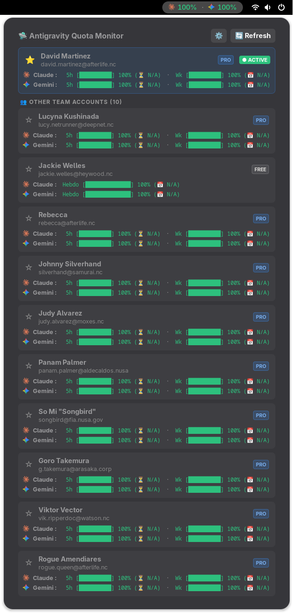

# 🛸 Antigravity Quota Monitor

[](https://gjs.guide/)
[](https://antigravity.google)
[](https://www.gnu.org/licenses/gpl-3.0)
[](https://gitlab.gnome.org/GNOME/gjs)

> **Antigravity Quota Monitor** is a native, modern, and lightweight GNOME Shell extension for real-time monitoring of your Antigravity AI model quotas (**Claude** & **Google Gemini**, 5-hour rolling window & weekly limits), featuring team multi-account support.

---

## 📋 Requirements & Compatibility

- **Desktop Environment**: GNOME Shell `45`, `46`, `47`, `48`, `49`, `50` (Wayland or X11).
- **IDE Target**: Developed and verified for **Antigravity IDE v2.5.5** *(Release: August 13, 2026)*.
- **Dependencies**: `gjs`, `libadwaita`, `libsoup-3.0` (included by default on modern GNOME distributions).

---

## ✨ Features

- 📊 **Top Bar Monitoring**:
  - Direct percentage display for Claude (`⚡`) and Gemini (`🔷`).
  - Configurable display mode selector: **5h Limit**, **Weekly Limit**, or **Both**.
  - Dynamic color coding based on critical alert threshold (🟢 Green, 🟡 Yellow, 🔴 Red).
- 📋 **Comprehensive Popup Menu**:
  - ASCII progress bars and exact percentage gauges.
  - Real-time countdown for 5h quota replenishments and weekly reset schedule.
  - Overview of all registered team members and accounts.
- 🌟 **Star Selection (⭐ / ☆)**:
  - Instant top bar account switching with a single click on the star icon.
- 🪄 **Automatic Session Capture**:
  - Automatic and secure detection of active local IDE sessions (Language Server) without requiring manual token entry.
  - Strict quota isolation between multiple instances and team accounts.
- ⚡ **Network Optimization & Offline Cache**:
  - Local countdown calculation without any network requests.
  - Configurable refresh interval (default: 300s, disable with 0s).
- 🎨 **Modern Libadwaita Interface**:
  - Full-featured preferences window built with modern Adwaita widgets.
  - Seamless GNOME Dark / Light mode integration.

---

## 🖥️ Interface Preview

<div align="center">
  
</div>

### 1. Top Bar
```text
⚡ 100% · 🔷 84%
```
*(or with weekly limit: `⚡ 100% [W:6%] · 🔷 84% [W:41%]`)*

### 2. Popup Menu
```text
┌─────────────────────────────────────────────────────────────────────────────┐
│ 🛸 Antigravity Quota Monitor                                [ ⚙️ ] [ 🔄 Refresh ]│
├─────────────────────────────────────────────────────────────────────────────┤
│ ⭐ John Doe (john.doe@example.com)                                  ● ACTIVE │
│   ⚡ Claude :  5h [██████████] 100% (Ready)     ·  Wk [█░░░░░░░░░] 6% (📅 Mon.)│
│   🔷 Gemini :  5h [████████░░] 84% (⏳ 2h15)   ·  Wk [████░░░░░░] 41% (📅 Mon.)│
├─────────────────────────────────────────────────────────────────────────────┤
│ 👥 OTHER TEAM ACCOUNTS (1)                                                  │
│ ☆ Jane Smith (jane.smith@example.com)                                       │
│   ⚡ Claude :  5h [██████████] 100% (Ready)     ·  Wk [█████░░░░░] 51% (📅 Mon.)│
│   🔷 Gemini :  5h [█████████░] 93% (⏳ 4h10)   ·  Wk [██████████] 99% (📅 Mon.)│
└─────────────────────────────────────────────────────────────────────────────┘
```

---

## 🚀 Installation

### Method 1: Automatic installation from source
Clone the repository and run the install script:

```bash
git clone https://github.com/bazinfla/gnome-antigravity.git
cd gnome-antigravity
./scripts/install.sh
```

- Under **Wayland**: Log out and log back into your GNOME session.
- Under **X11**: Press `Alt + F2`, type `r`, then press `Enter`.

### Method 2: Installation via ZIP package
To build and install the standard extension package:

```bash
./scripts/pack.sh
gnome-extensions install --force dist/antigravity-quota@bazinfla.github.com.shell-extension.zip
gnome-extensions enable antigravity-quota@bazinfla.github.com
```

### 🗑️ Uninstallation
To completely remove the extension:

```bash
gnome-extensions uninstall antigravity-quota@bazinfla.github.com
```

---

## ⚙️ Configuration & Preferences

You can open the extension preferences:
- By clicking the gear icon `⚙️` in the popup menu header.
- Or via command line:
  ```bash
  gnome-extensions prefs antigravity-quota@bazinfla.github.com
  ```

### Available options:
1. **Top bar display limit**:
   - `5h (Default)`: Displays the 5-hour rolling quota.
   - `Weekly`: Displays the remaining weekly quota.
   - `Both`: Displays 5h limits with weekly reminders in brackets.
2. **Refresh interval**:
   - Adjustable from `0` to `3600` seconds (Default: `300s` / 5 minutes).
   - Setting to `0` disables background auto-refresh.
3. **Critical alert threshold (%)**:
   - Percentage below which text turns critical red (`0` to disable).
4. **Team account management**:
   - **"🪄 Capture IDE Session"** button to automatically import active sessions.
   - Individual deletion button (trash icon) to remove an account.

---

## 🏗️ Project Architecture

```text
gnome-antigravity/
├── src/                               # Extension source code
│   ├── extension.js                   # GNOME Shell entry point (Extension lifecycle)
│   ├── prefs.js                       # Adwaita preferences window (Adw.PreferencesPage)
│   ├── metadata.json                  # Metadata and GNOME version compatibility (45+)
│   ├── stylesheet.css                 # Top bar indicator and account card styles
│   ├── schemas/                       # GSettings schemas (compiled GSchema XML)
│   │   └── org.gnome.shell.extensions.antigravity.gschema.xml
│   ├── ui/                            # Visual UI components
│   │   ├── panelButton.js             # Top bar indicator with event listeners
│   │   ├── popupMenu.js               # Unified popup menu with ⚙️ button
│   │   └── accountCard.js             # Visual account card (gauges, timers, star)
│   └── lib/                           # Core engines and business logic
│       ├── accounts.js                # Account configuration manager (~/.config/gnome-antigravity/)
│       ├── api.js                     # Local RPC communication with Language Server
│       ├── cache.js                   # Persistent disk cache (~/.cache/gnome-antigravity/)
│       └── quotaEngine.js             # Sync engine and countdown timers
├── scripts/                           # Build and deployment utility scripts
│   ├── install.sh                     # Compile and deploy locally to GNOME Shell
│   └── pack.sh                        # Standard packaging into dist/*.shell-extension.zip
├── .gitignore                         # Git exclusion rules
├── LICENSE                            # Open-source GPL-3.0 license
└── README.md                          # Project documentation
```

---

## 🔒 Privacy & Security

- **100% Local**: All queries are performed locally (`127.0.0.1`) directly against the running Antigravity language server.
- **Zero third-party telemetry**: Credentials, tokens, and email addresses never leave your machine.
- **Locally stored data**:
  - Configuration: `~/.config/gnome-antigravity/accounts.json`
  - Quota cache: `~/.cache/gnome-antigravity/cache.json`

---

## 📄 License

This project is licensed under the **GNU General Public License v3.0** - see the [LICENSE](LICENSE) file for details.
